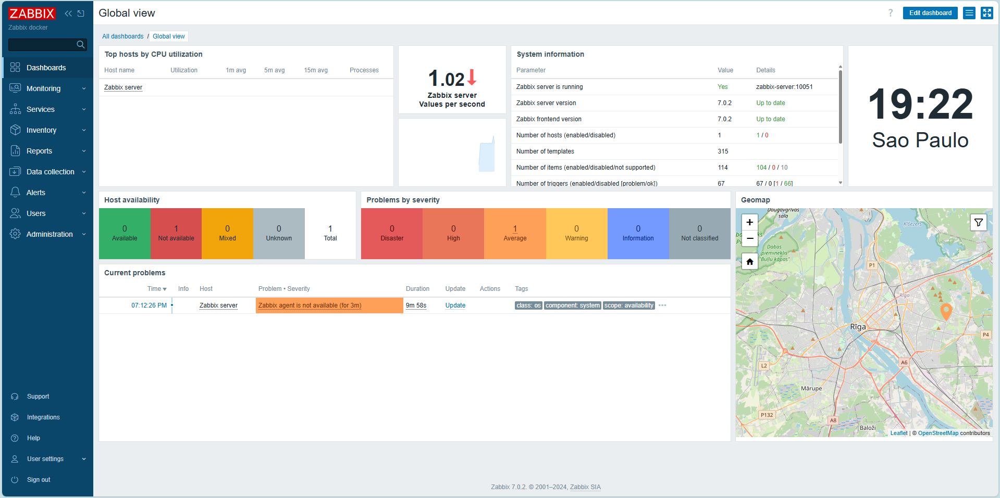

# Zabbix on Docker



## Intallation
```ps1
# Check
$PSVersionTable.PSVersion
Get-Module -Name AzureRM -ListAvailable
Get-ExecutionPolicy -List
Set-ExecutionPolicy -ExecutionPolicy RemoteSigned -Scope CurrentUser

# Install
Install-Module -Name Az -Repository PSGallery -Force

# Update
Update-Module -Name Az -Force

# Login
Connect-AzAccount
```

## Use

```sh
git clone https://github.com/saulotarsobc/zabbix-on-docker.git;
cd zabbix-on-docker;
docker compose up -d;
```

## Help

## Tutorial

- [Zabbix Series: 02- Instalación Zabbix usando Docker](https://youtu.be/kD8FHo-OUbQ)
- [Instalação do Zabbix no Docker / instalação e configuração do Agent Zabbix](https://youtu.be/WHwaapu8ntI)
- [Instalar o Azure PowerShell no Windows](https://learn.microsoft.com/pt-br/powershell/azure/install-azps-linux?view=azps-12.1.0)

## [zabbix/zabbix-web-apache-mysql](https://hub.docker.com/r/zabbix/zabbix-web-apache-mysql)

- `ZBX_SERVER_HOST`: _This variable is IP or DNS name of Zabbix server. By default, value is zabbix-server._
- `ZBX_SERVER_PORT`: _This variable is port Zabbix server listening on. By default, value is 10051._
- `DB_SERVER_HOST`: _This variable is IP or DNS name of MySQL server. By default, value is 'mysql-server'.This variable is port of MySQL server. By default, value is '3306'._
- `DB_SERVER_PORT`, `MYSQL_USER`, `MYSQL_PASSWORD`, `MYSQL_USER_FILE` and `MYSQL_PASSWORD_FILE`: _These variables are used by Zabbix web-interface to connect to Zabbix database. With the \_FILE variables you can instead provide the path to a file which contains the user / the password instead. Without Docker Swarm or Kubernetes you also have to map the files. Those are exclusive so you can just provide one type - either MYSQL_USER or MYSQL_USER_FILE!_

## [zabbix/zabbix-server-mysql](https://hub.docker.com/r/zabbix/zabbix-server-mysql)

- `DB_SERVER_HOST`: _This variable is IP or DNS name of MySQL server. By default, value is 'mysql-server'_
- `DB_SERVER_PORT`: _This variable is port of MySQL server. By default, value is '3306'._
- `MYSQL_USER`, `MYSQL_PASSWORD`, `MYSQL_USER_FILE` and `MYSQL_PASSWORD_FILE`: _These variables are used by Zabbix server to connect to Zabbix database. With the \_FILE variables you can instead provide the path to a file which contains the user / the password instead. Without Docker Swarm or Kubernetes you also have to map the files. Those are exclusive so you can just provide one type - either MYSQL_USER or MYSQL_USER_FILE!_
